# AgentSystem System Relationship Map

> **核心架构理念**：AgentSystem 是**有状态、全持久化的 App OS**。App 是功能模块和隔离边界（光脑模型），用户命令 = 工作流，工作流负责启动、停止、修改和管理 App。

> 目标：把**模块、功能、测试**放进同一张"关系网"里。只要存在明显依赖、调用、覆盖、影响或共同演化关系，就连一条边。
>
> 用途：后续改动时，用这份文档快速检查"会牵动哪些地方、哪些测试要补跑、哪些文档要更新"，尽量减少漏改。

---

## 1. 使用方式

当你准备改某个模块时,建议按下面顺序使用这份图:

1. 先在 **功能关系图** 里定位能力域
2. 再看 **模块关系图** 找直接依赖
3. 再看 **测试映射图** 找应补跑的单测 / 集成测试
4. 最后看 **改动检查清单**,避免漏掉 docs / API / runtime wiring / persistence

---

## 2. 顶层能力关系图

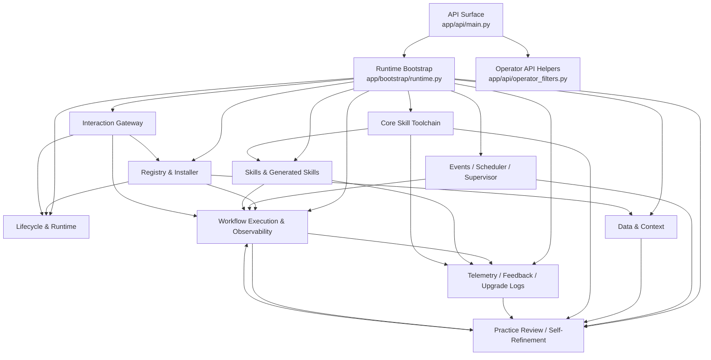

---

## 3. 模块关系网(按域分组)

### 3.1 App / Runtime Core

```mermaid
graph TD
    BR[app/bootstrap/runtime.py] --> LC[services/lifecycle.py]
    BR --> RH[services/runtime_host.py]
    BR --> RS[services/runtime_state_store.py]
    BR --> AR[services/app_registry.py]
    BR --> AI[services/app_installer.py]
    BR --> AD[services/app_data_store.py]
    BR --> AC[services/app_context_store.py]
    BR --> SCH[services/scheduler.py]
    BR --> EV[services/event_bus.py]
    BR --> SUP[services/supervisor.py]
    BR --> WE[services/workflow_executor.py]
    BR --> WO[services/workflow_observability.py]
    BR --> WS[services/workflow_subscription.py]
    BR --> PR[services/practice_review.py]
    BR --> SR[services/self_refinement.py]
    BR --> RL[services/refinement_loop.py]
    BR --> RM[services/refinement_memory.py]
    BR --> RR[services/refinement_rollout.py]
    BR --> SG[services/skill_suggestion.py]
    BR --> SF[services/skill_factory.py]
    BR --> SKR[services/skill_runtime.py]
    BR --> IG[services/interaction_gateway.py]

    AI --> AR
    AI --> LC
    AI --> RH
    AI --> AD
    AI --> AC

    RH --> LC
    SCH --> LC
    SCH --> RH
    EV --> SCH
    SUP --> LC
    SUP --> RH
```

### 3.2 Registry / Blueprint / Install

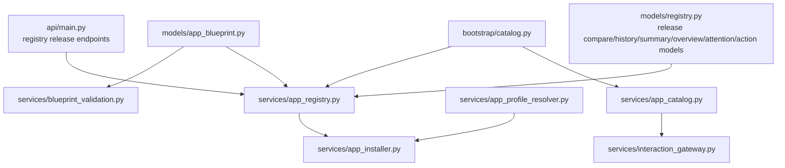

### 3.3 Data / Context / Persistence

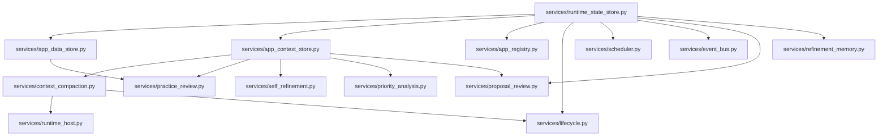

### 3.4 Workflow Execution / Observability

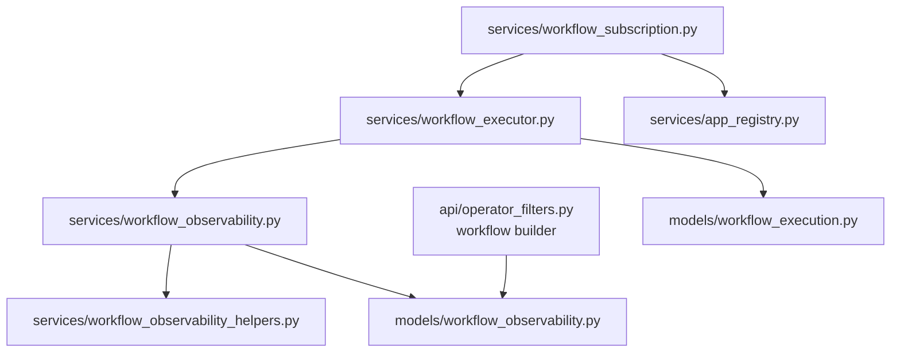

### 3.5 Learning / Self-Refinement / Rollout

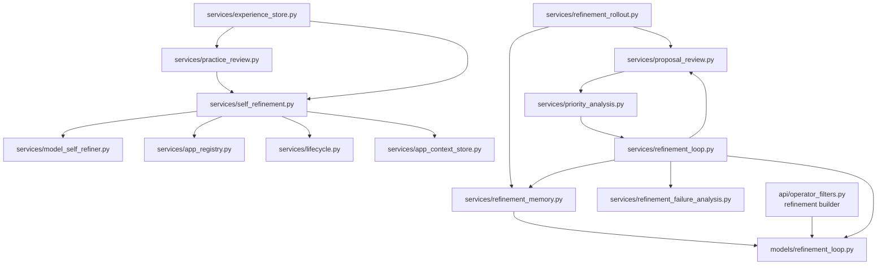

### 3.6 Skills / Generated Skills / System Skills

> Security note: changes in skill manifest risk metadata or script command restrictions should be treated as cross-cutting changes touching manifest models, validators, generated-skill flows, runtime assumptions, and security-oriented tests.


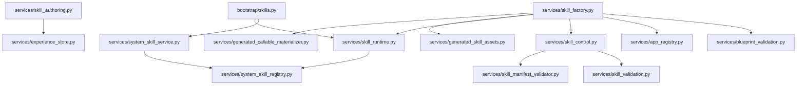

### 3.7 Interaction / Routing

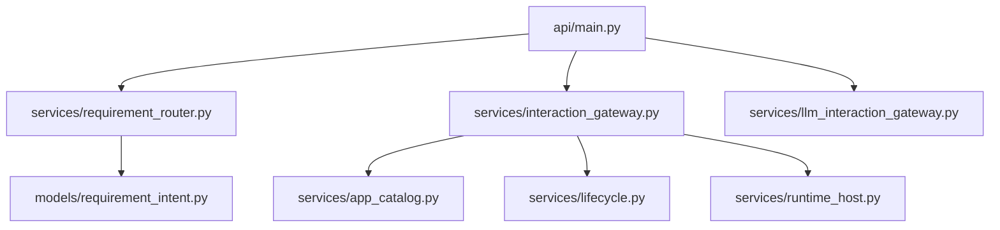

### 3.7.1 LLM Interaction Gateway (Phase 7)

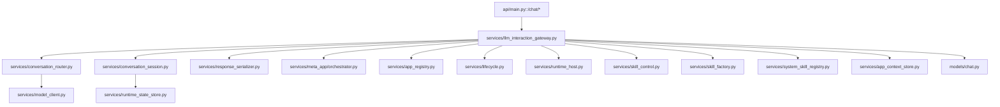

> Integration note: LLM interaction gateway depends on all existing subsystem services it routes to. Changes in any routed service should be treated as potentially affecting the conversation router's extracted parameters and response construction.

### 3.7.2 Chat Regression Governance Surface

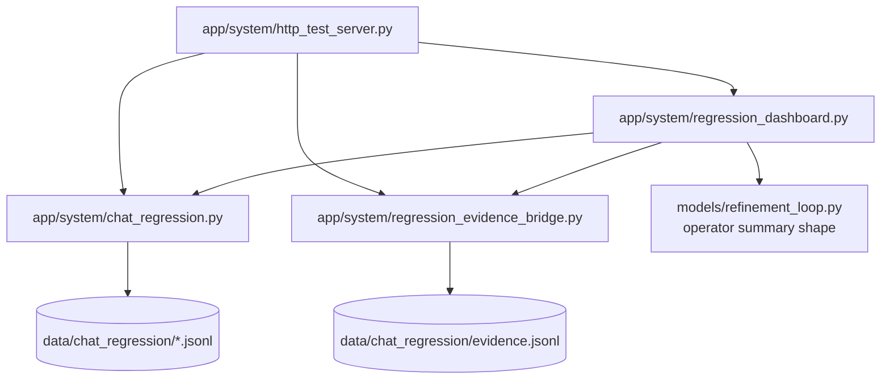

> Regression note: the chat regression surface is now a real operator loop, not just a harness. Changes in persistence shape, comparison aggregation, evidence promotion, or governance summary fields should be treated as coupled changes across `chat_regression.py`, `regression_evidence_bridge.py`, `regression_dashboard.py`, `http_test_server.py`, and HTTP regression tests.

### 3.8 Asset-Centered Runtime Rewrite (in progress)

```mermaid
graph TD
    BR2[app/bootstrap/runtime.py] --> SO[app/system/startup/startup_orchestrator.py]
    SO --> ACB[app/system/asset_center/bootstrap.py]
    SO --> ACR[app/system/asset_center/registry.py]
    SO --> ACS[app/system/asset_center/service.py]
    SO --> MPL[app/system/model_runtime/model_pool_loader.py]
    SO --> MCR[app/system/model_runtime/model_client_registry.py]
    SO --> MPB[app/system/model_runtime/model_probe.py]
    SO --> MSEL[app/system/model_runtime/model_selector.py]
    SO --> REGP[app/system/assets/registration_protocol.py]
    SO --> DESC[app/system/assets/descriptor_builder.py]
    SO --> SIA[app/system/assets/self_iteration_center_asset.py]
    SO --> CCA[app/system/assets/config_center_asset.py]
    SO --> CACTX[app/system/interaction_runtime/context_assembly.py]
    SO --> IDP[app/system/interaction_runtime/decision_protocol.py]
    SO --> IORCH[app/system/interaction_runtime/interaction_orchestrator.py]
    IORCH --> INVD[app/system/invocation/invocation_dispatcher.py]
    INVD --> MRC[app/system/invocation/model_resolved_call.py]
    INVD --> MSEL
    ACS --> ACON[app/models/asset_contract.py]
    DESC --> ACON
    SIA --> ACS
    CCA --> ACS
```

**Current dependency intent**
- `asset_center` is the only metadata truth entry for runtime-visible assets and model resources.
- `model_runtime` owns external model config loading, probing, health view, and preferred/fallback selection. It must not be folded back into asset metadata indexing.
- `startup_orchestrator` owns the hard startup order: `asset_center -> model_runtime -> system_assets -> interaction_runtime -> entrypoints`.
- `interaction_runtime` is the new bounded interaction chain. It should converge on `text / need_asset_detail_id / invoke` instead of expanding the old gateway patch surface.
- `invocation_dispatcher` resolves model requirements before execution, but does not own asset discovery or user-facing response shaping.
- old gateway bounded-route logic and model-visible `query_asset_* / list_assets` exposure should be treated as transitional shells until the new interaction runtime fully takes over.

**Primary tests to rerun when editing this slice**
- `tests/unit/test_asset_centered_runtime_foundation.py`
- `tests/unit/test_runtime_asset_center_registry.py`
- `tests/unit/test_runtime_asset_new_chain_acceptance.py`
- `tests/unit/test_runtime_asset_intent_parsing.py`
- `tests/unit/test_runtime_asset_deeper_mappings.py`
- `tests/unit/test_runtime_asset_worker_mappings.py`
- `tests/unit/test_runtime_asset_management_worker.py`
- `tests/unit/test_runtime_asset_gateway_registration.py` (transitional; new-chain lightweight acceptance replaces old slow e2e)
- `tests/unit/test_model_runtime_foundation.py`
- `tests/unit/test_model_selector.py` (Phase 9.1)
- `tests/unit/test_asset_descriptor_schema.py` (Phase 9.1)
- `tests/unit/test_asset_center_manifest_validation.py`
- `tests/unit/test_interaction_decision_protocol.py`
- `tests/unit/test_interaction_runtime_integration.py`
- `tests/unit/test_invocation_dispatcher.py`
- `tests/unit/test_skill_asset_api.py`
- `tests/unit/test_tool_calling_interpreter.py` (legacy shell; retained for backward compat)
- `tests/unit/services/test_hot_tool_manager.py` (asset tool discovery; converged to call_asset_method only)

### 3.9 External Model / Config

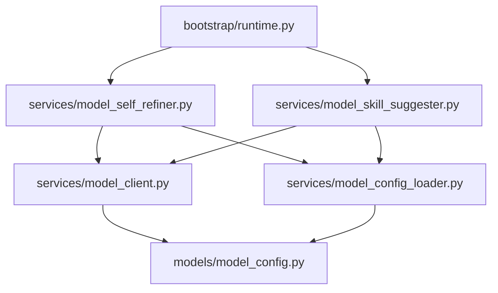

### 3.9 Planned telemetry / feedback / upgrade-log layer

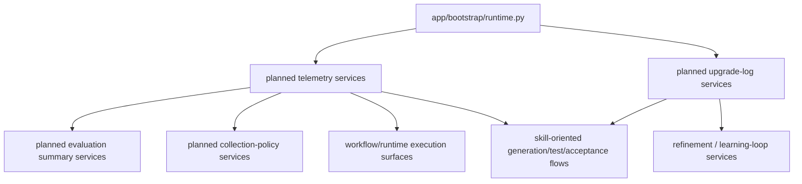

> Design note: this layer is intentionally split between a platform-defined standard substrate and skill-extensible higher-level workflows.

---

## 4. Operator Surface Contract Map

> 这是最近持续在统一的一条主线,和后续运维视图、自我迭代都强相关。

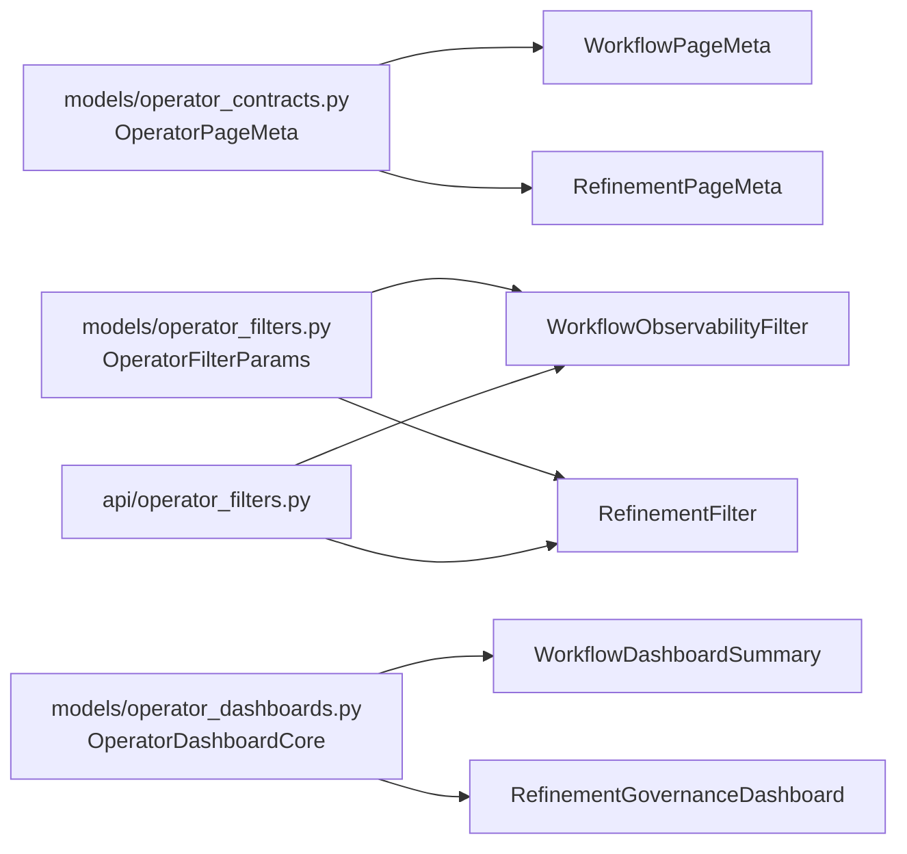

**改这里通常会影响:**
- `app/models/workflow_observability.py`
- `app/models/refinement_loop.py`
- `app/api/operator_filters.py`
- `app/api/main.py`
- `tests/unit/test_operator_page_meta.py`
- `tests/unit/test_operator_filter_params.py`
- `tests/unit/test_operator_dashboard_core.py`
- workflow / refinement 各自 observability 测试

---

## 5. 功能 -> 模块 -> 测试 映射图

## 5.1 Requirement Router / Intent Routing

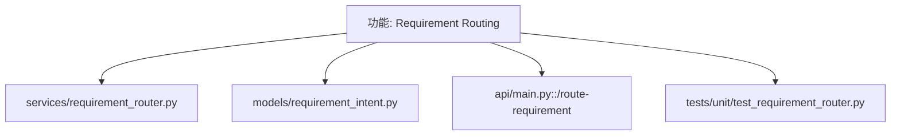

## 5.2 Registry / Install / Lifecycle

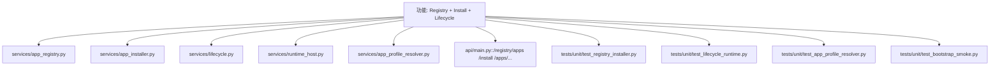

> Release-governance note: app registry changes now affect both raw release lists and higher-level release compare/history/summary/overview/attention/action read models, so control-plane/API consumers should treat those surfaces as one coupled contract.

## 5.3 Data / Context / Compaction

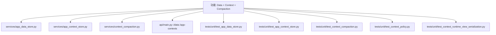

## 5.4 Event Bus / Scheduler / Supervisor

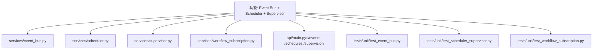

## 5.5 Workflow Execution / Failure / Observability

```mermaid
graph TD
    F[功能: Workflow Execution + Observability]
    F --> WE[services/workflow_executor.py]
    F --> WO[services/workflow_observability.py]
    F --> WOH[services/workflow_observability_helpers.py]
    F --> MC[models/workflow_execution.py]
    F --> MO[models/workflow_observability.py]
    F --> APIO[api/operator_filters.py]
    F --> A[api/main.py::/workflows/...]
    F --> T1[tests/unit/test_workflow_executor.py]
    F --> T2[tests/unit/test_workflow_observability.py]
    F --> T3[tests/unit/test_workflow_execution_failure_observability.py]
    F --> T4[tests/unit/test_observability.py]
    F --> T5[tests/unit/test_api_golden_path.py]
    F --> T6[tests/unit/test_golden_path_integration.py]
```

## 5.6 Telemetry / Feedback / Upgrade Logs

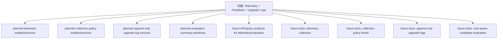

> Coupling note: telemetry changes should be treated as cross-cutting across workflow execution, generated skills, self-refinement, publish/rollback governance, and operator read models.

## 5.7 Practice Review / Experience / Demonstration Extraction

```mermaid
graph TD
    F[功能: Practice Review + Experience Learning]
    F --> ES[services/experience_store.py]
    F --> PR[services/practice_review.py]
    F --> DE[services/demonstration_extractor.py]
    F --> A[api/main.py::/practice/review /experiences /demonstrations/extract]
    F --> T1[tests/unit/test_experience_store.py]
    F --> T2[tests/unit/test_practice_review.py]
    F --> T3[tests/unit/test_demonstration_extractor.py]
```

## 5.8 Self-Refinement Proposal Generation

```mermaid
graph TD
    F[功能: Self-Refinement Proposal Generation]
    F --> SR[services/self_refinement.py]
    F --> MSR[services/model_self_refiner.py]
    F --> MLOAD[services/model_config_loader.py]
    F --> MCL[services/model_client.py]
    F --> PRR[services/proposal_review.py]
    F --> A[api/main.py::/self-refinement/propose /proposals /reviews]
    F --> T1[tests/unit/test_self_refinement.py]
    F --> T2[tests/unit/test_model_config.py]
    F --> T3[tests/unit/test_runtime_model_refiner_toggle.py]
    F --> T4[tests/e2e/test_external_model_api_flow.py]
```

## 5.9 Refinement Loop / Priority / Rollout / Memory / Governance

```mermaid
graph TD
    F[功能: Refinement Loop + Governance]
    F --> PA[services/priority_analysis.py]
    F --> RL[services/refinement_loop.py]
    F --> RM[services/refinement_memory.py]
    F --> RR[services/refinement_rollout.py]
    F --> RFA[services/refinement_failure_analysis.py]
    F --> M[models/refinement_loop.py]
    F --> APIO[api/operator_filters.py]
    F --> A[api/main.py::/self-refinement/loop /overview /dashboard /stats /governance-dashboard]
    F --> T1[tests/unit/test_priority_analysis.py]
    F --> T2[tests/unit/test_refinement_loop.py]
    F --> T3[tests/unit/test_refinement_loop_persistence.py]
    F --> T4[tests/unit/test_refinement_rollout.py]
    F --> T5[tests/unit/test_refinement_overview.py]
    F --> T6[tests/unit/test_refinement_dashboard.py]
    F --> T7[tests/unit/test_refinement_failure_awareness.py]
    F --> T8[tests/unit/test_refinement_filters_and_stats.py]
    F --> T9[tests/unit/test_refinement_governance_dashboard.py]
    F --> T10[tests/unit/test_api_refinement_governance_path.py]
    F --> T11[tests/unit/test_refinement_observability_api.py]
```

## 5.10 Skill Suggestion / Skill Runtime / System Skills / Generated Skills

```mermaid
graph TD
    F[功能: Skills Runtime + Suggestion + Generation]
    F --> SG[services/skill_suggestion.py]
    F --> SKR[services/skill_runtime.py]

> Blueprint note: governance-aware skill suggestion now affects both natural-language steps and machine-readable `SkillBlueprint.safety_profile`, so downstream generation/materialization changes should treat blueprint metadata as part of the same coupling surface.
    F --> SC[services/skill_control.py]
    F --> APR[services/app_profile_resolver.py]
    F --> SA[services/skill_authoring.py]
    F --> SF[services/skill_factory.py]
    F --> SMV[services/skill_manifest_validator.py]
    F --> GCM[services/generated_callable_materializer.py]

> Factory note: `SkillFactoryService` now consumes `SkillBlueprint.safety_profile` when deriving creation defaults, so changes to blueprint safety metadata should be treated as also affecting generated-skill materialization defaults.

> Propagation note: blueprint-derived `manifest_risk` now flows through `SkillCreationRequest` into `SkillAuthoringService` and the final registered `SkillManifest`, so changes in request-model fields, authoring helpers, or manifest-risk semantics can break materialization, validation, and override behavior together.

> Origin note: generated-skill durability now depends on registry origin metadata (`builtin | generated | manual`) staying aligned across built-in bootstrap, generated-skill authoring, persisted asset payloads, and reload registration; edits to any one of those surfaces should be treated as affecting Phase-1 asset identity guarantees.

> Skeleton note: generated app assembly now depends on `AppProfileResolverService` to derive richer blueprint skeleton defaults (execution mode, tasks, views, idle behavior) from selected skills, so app-profile logic changes should be treated as affecting `/apps/from-skills` output shape and generated-app metadata expectations.

> Profile note: inferred `AppRuntimeProfile` data now flows into generated `AppBlueprint.runtime_profile`, `AppRegistryEntry.runtime_profile_summary`, install-result payloads, and later `AppInstance.runtime_profile`, so edits to app-profile resolution or registry registration should be treated as affecting both pre-install and post-install runtime metadata contracts.

> Shape note: generated app assembly now performs lightweight app-shape classification from skill metadata and schema field names, so changes to skill naming/tagging/schema conventions can affect generated role names, task semantics, operator-view labels, and now explicit `app_shape` metadata even when workflow structure stays the same.
    F --> GSA[services/generated_skill_assets.py]
    F --> SSR[services/system_skill_registry.py]
    F --> SSS[services/system_skill_service.py]
    F --> A[api/main.py::/skills /apps/from-skills /skill-runtime/...]
    F --> T1[tests/unit/test_skill_suggestion.py]
    F --> T2[tests/unit/test_skill_runtime.py]

> Suggestion note: skill suggestion now depends not only on experience data and optional model synthesis, but also on risk governance state when available. Changes in risk policy summaries - especially blueprint-materialization pressure - can therefore alter generated-skill suggestion behavior and preferred artifact shape.
    F --> T3[tests/unit/test_skill_runtime_adapters.py]
    F --> T4[tests/unit/test_skill_control.py]
    F --> T5[tests/unit/test_skill_authoring.py]
    F --> T6[tests/unit/test_skill_factory_api.py]
    F --> T23[tests/unit/test_skill_manifest_validator.py]
    F --> T7[tests/unit/test_skill_diagnostics_api.py]
    F --> T8[tests/unit/test_generated_callable_skill.py]
    F --> T9[tests/unit/test_generated_skill_persistence.py]
    F --> T10[tests/unit/test_generated_skill_durability.py]
    F --> T11[tests/unit/test_generated_app_durability.py]
    F --> T12[tests/unit/test_system_app_config_skill.py]
    F --> T13[tests/unit/test_system_context_skill.py]
    F --> T14[tests/unit/test_system_state_and_audit_skills.py]
    F --> T15[tests/unit/test_skill_factory_risk_gating.py]
    F --> T20[tests/unit/test_skill_blueprint_safety_defaults.py]
    F --> T21[tests/unit/test_skill_blueprint_materialization_api.py]
    F --> T22[tests/unit/test_skill_blueprint_materialization_override_api.py]

> Default-selection note: blueprint safety metadata now affects materialization adapter default selection when callers omit `adapter_kind`, so artifact shape can change even without explicit adapter input.

> Policy note: blueprint materialization now consumes safety metadata as active policy, not just propagation metadata. Changes to `SkillBlueprint.safety_profile` can therefore affect whether materialization is allowed at all.

> Materialization note: blueprint materialization now surfaces the final registered skill state, so changes in manifest/capability propagation should be treated as affecting not just request construction but end-to-end generated skill artifacts.

> Override note: `blueprint_materialization` overrides now only work end-to-end if API policy checks, creation-request risk fields, authoring helpers, and manifest validation all agree on the same shell-risk state; treat those as one coupled surface during edits.
    F --> T16[tests/unit/test_skill_policy_diagnostics_api.py]
    F --> T17[tests/unit/test_skill_risk_policy.py]
    F --> T18[tests/unit/test_skill_risk_override_api.py]
    F --> T19[tests/unit/test_skill_risk_dashboard.py]

> Governance note: skill risk policy now has both decision state and event trail. Changes here should be treated as touching policy persistence, generated app assembly, API governance surfaces, and future audit/dashboard layers.
```

## 5.11 Interaction Gateway / End-to-End API Usable Flow

```mermaid
graph TD
    F[功能: User Interaction + API Usable Flow]
    F --> IG[services/interaction_gateway.py]
    F --> ACAT[services/app_catalog.py]
    F --> A[api/main.py::/interaction/command]
    F --> T1[tests/unit/test_interaction_gateway.py]
    F --> T2[tests/e2e/test_api_usable_flow.py]
```

## 5.12 LLM Interaction Gateway (Phase 7)

```mermaid
graph TD
    F[功能: LLM-Powered Conversation Interface]
    F --> LIG[services/llm_interaction_gateway.py]
    F --> CR[services/conversation_router.py]
    F --> CS[services/conversation_session.py]
    F --> RS[services/response_serializer.py]
    F --> MCH[models/chat.py]
    F --> MCL[services/model_client.py]
    F --> MAO[services/meta_app/orchestrator.py]
    F --> AR[services/app_registry.py]
    F --> LC[services/lifecycle.py]
    F --> RH[services/runtime_host.py]
    F --> SC[services/skill_control.py]
    F --> A[api/main.py::/chat/*]
    F --> T1[tests/unit/test_conversation_session.py]
    F --> T2[tests/unit/test_conversation_router.py]
    F --> T3[tests/unit/test_llm_interaction_gateway.py]
    F --> T4[tests/unit/test_response_serializer.py]
    F --> T5[tests/e2e/test_llm_chat_flow.py]
```

> Phase 7 note: the LLM interaction gateway wraps all existing subsystem services. Changes in routed services (meta-app, registry, lifecycle, skill control) should be treated as potentially affecting conversation response construction and action suggestion generation.

---

## 5.13 Chat Regression / Governance Loop

```mermaid
graph TD
    F[功能: Chat Regression Governance]
    F --> H[app/system/http_test_server.py]
    F --> CR[app/system/chat_regression.py]
    F --> REB[app/system/regression_evidence_bridge.py]
    F --> RGD[app/system/regression_dashboard.py]
    F --> T1[tests/unit/test_chat_regression.py]
    F --> T2[tests/unit/test_http_test_server.py]
```

**关键接口面:**
- `POST /api/chat-regression/run`
- `GET /api/chat-regression/latest`
- `GET /api/chat-regression/runs`
- `GET /api/chat-regression/runs/{run_id}`
- `GET /api/chat-regression/compare`
- `GET /api/chat-regression/trends`
- `POST /api/chat-regression/evidence`
- `GET /api/chat-regression/evidence`
- `GET /api/governance/regression-dashboard`
- `GET /api/governance/operator-summary`
- `POST /api/governance/regression-triggers`

**改这里通常会影响:**
- `data/chat_regression/*.jsonl` 持久化兼容性
- evidence topic 过滤规则（当前按 `summary/scope_key` 匹配 topic 名）
- refinement governance summary 字段映射
- 风险信号到自动 refinement action 的映射
- HTTP 端点测试与 dashboard contract 断言

## 6. 测试关系网(按"改哪里,先跑哪些"组织)

### 6.1 改 `app/api/main.py`

优先跑:
- `tests/unit/test_api_golden_path.py`
- `tests/unit/test_api_refinement_governance_path.py`
- 对应功能域的 unit tests
- `tests/e2e/test_api_usable_flow.py`(如果改动较大)

### 6.2 改 `app/bootstrap/runtime.py`

优先跑:
- `tests/unit/test_bootstrap_smoke.py`
- `tests/unit/test_runtime_model_refiner_toggle.py`
- `tests/unit/test_lifecycle_runtime.py`
- 任何被 runtime wiring 接入的域测试

### 6.3 改 workflow observability / operator contract

优先跑:
- `tests/unit/test_workflow_observability.py`
- `tests/unit/test_workflow_execution_failure_observability.py`
- `tests/unit/test_observability.py`
- `tests/unit/test_operator_page_meta.py`
- `tests/unit/test_operator_filter_params.py`
- `tests/unit/test_operator_dashboard_core.py`
- `tests/unit/test_operator_api_filters.py`

### 6.4 改 refinement governance / self-refinement

优先跑:
- `tests/unit/test_self_refinement.py`
- `tests/unit/test_priority_analysis.py`
- `tests/unit/test_refinement_loop.py`
- `tests/unit/test_refinement_failure_awareness.py`
- `tests/unit/test_refinement_rollout.py`
- `tests/unit/test_refinement_filters_and_stats.py`
- `tests/unit/test_refinement_governance_dashboard.py`
- `tests/unit/test_api_refinement_governance_path.py`

### 6.5 改 skill runtime / generated skills

优先跑:
- `tests/unit/test_skill_runtime.py`
- `tests/unit/test_skill_runtime_adapters.py`
- `tests/unit/test_skill_control.py`
- `tests/unit/test_skill_factory_api.py`
- `tests/unit/test_generated_callable_skill.py`
- `tests/unit/test_generated_skill_persistence.py`
- `tests/unit/test_generated_skill_durability.py`
- `tests/unit/test_generated_app_durability.py`

### 6.6 改 LLM interaction gateway / conversation router

优先跑:
- `tests/unit/test_conversation_session.py`
- `tests/unit/test_conversation_router.py`
- `tests/unit/test_llm_interaction_gateway.py`
- `tests/unit/test_response_serializer.py`
- `tests/e2e/test_llm_chat_flow.py`
- 如果被路由的 service 也改了,同时跑对应域测试

---

## 7. 改动检查清单(防漏改)

### 7.1 改模型(`app/models/*`)时

检查:
- 哪些 service 构造 / 返回它?
- 哪些 API endpoint 直接 `model_dump` 它?
- 哪些测试在断言字段名?
- docs 里的 contract / design / testing 是否需要同步?

### 7.2 改 service(`app/services/*`)时

检查:
- runtime bootstrap 有没有 wiring 变化?
- API 是否需要新增/修改入口?
- persistence 是否需要迁移或兼容?
- 对应 unit tests / golden path tests 是否要补?

### 7.3 改 API helper / operator contract 时

检查:
- `app/api/main.py`
- `app/api/operator_filters.py`
- `app/models/operator_*`
- workflow / refinement 两侧是否都要同步
- `test_operator_*` 系列是否都要补跑

### 7.4 改 self-refinement / model path 时

检查:
- `app/bootstrap/runtime.py`
- `services/self_refinement.py`
- `services/model_self_refiner.py`
- `services/model_config_loader.py`
- `tests/unit/test_runtime_model_refiner_toggle.py`
- `tests/unit/test_self_refinement.py`
- `tests/e2e/test_external_model_api_flow.py`

### 7.5 改 refinement loop / rollout 验证策略时

检查:
- `services/refinement_loop.py`
- `services/refinement_rollout.py`
- `services/refinement_memory.py`
- `tests/unit/test_refinement_loop.py`
- `tests/unit/test_refinement_rollout.py`
- `tests/unit/test_refinement_filters_and_stats.py`
- `tests/unit/test_refinement_governance_dashboard.py`
- 是否影响 API path 测试的耗时与稳定性

### 7.6 改 chat regression / governance loop 时

检查:
- `app/system/chat_regression.py`
- `app/system/regression_evidence_bridge.py`
- `app/system/regression_dashboard.py`
- `app/system/http_test_server.py`
- `tests/unit/test_chat_regression.py`
- `tests/unit/test_http_test_server.py`
- `docs/testing.md` 与 `docs/development-log.md` 是否需要同步
- JSONL 持久化字段是否保持后向兼容

---

## 8. 关系边定义说明

本图里的边不是只表示"import"。它表示下面任意一种关系:

- 直接调用 / 依赖
- 运行时 wiring
- 共享 contract
- 同一能力域
- API 对 service 的暴露
- 测试对模块/功能的覆盖
- 后续演化时应一起检查的耦合关系

也就是说,这是一张**改动影响网**,不是纯代码静态依赖图。

---

## 9. 维护建议

> **强制维护规则**
>
> `docs/system-relationship-map.md` 是 AgentSystem 的长期系统关系索引。
> 以后无论是人工开发还是系统自我迭代,只要发生以下任一种改动,都必须同步更新本文件:
>
> - 新增/删除/重命名模块
> - 新增/删除/重命名 API、service、model、bootstrap wiring
> - 新增功能域或功能边界变化
> - 新增、删除或迁移重要测试
> - 新增 shared contract / shared helper
> - 任何导致"改哪里会牵动哪些地方"答案变化的结构调整
>
> 原则:**代码变了,关系网也要变。**
> 不允许把本文件当成一次性文档;它必须和系统一起演化。

后续每完成一个模块,建议同步更新这里至少一处:

- 新增能力域 → 在"功能 -> 模块 -> 测试映射图"补一块
- 新增 shared contract → 在"Operator Surface Contract Map"补节点
- 新增重要测试 → 挂到对应功能图和"改哪里先跑哪些"里
- 如果两个模块开始频繁一起改 → 即使不是直接 import,也补一条边

> 原则:**宁可多连一条边,也不要少连一条会导致漏改的边。**

### 6.7 改 chat regression / governance loop 时

优先跑:
- `tests/unit/test_chat_regression.py`
- `tests/unit/test_http_test_server.py`
- 与 refinement governance summary 相关的 operator / dashboard 测试切片
- 任何涉及 JSONL persistence 兼容性的回归样例

检查:
- `app/system/chat_regression.py`
- `app/system/regression_evidence_bridge.py`
- `app/system/regression_dashboard.py`
- `app/system/http_test_server.py`
- `docs/testing.md` 与 `docs/development-log.md` 是否需要同步

### 6.6 改 telemetry / upgrade-log / collection-policy 时

优先跑:
- 未来 telemetry collection tests
- 未来 collection policy level tests
- 未来 append-only upgrade-log tests
- workflow / generated-skill / refinement 相关回归切片
- 任何 publish / rollback / candidate-evaluation 相关测试

### 3.10 Planned core-skill toolchain layer

```mermaid
graph TD
    CST[planned core skills] --> TLM[planned telemetry services]
    CST --> EVL[planned evaluation summary services]
    CST --> SKR[services/skill_runtime.py]
    CST --> SF[services/skill_factory.py]
    CST --> RL[services/refinement / learning-loop services]
```

> Growth note: the intended long-term path is that governed core skills produce and supervise ordinary-skill growth, while direct platform-core changes remain relatively rare and high-governance.

### 3.11 Phase H: LightBrain Gateway & Interpreter (资产化运行态与上下文主路径)

> **Phase H 完成时间**: 2026-04-22  
> **核心目标**: 收敛交互层一次 LLM 决策主路径，固化上下文注入与消费闭环
> **Phase H 后续验证**: Iteration 10 ~ Iteration 12 已在该主路径上完成 v2 场景回归

**Phase H 主路径流程**：

1. **用户消息进入** → `LightBrainGateway.process_message()` / `receive_message()`
2. **意图解释** → `LightBrainInterpreter.interpret()`
   - Exact match（greet/help/status）→ 本地直判，0 LLM 调用
   - Fuzzy match → regex 兜底
   - 其余 → LLM tool-aware 解释
3. **上下文注入** → interpreter 消费 `recent_session_context` / `linked_session_context` / `child_session_contexts`
4. **生成 context hints** → 回填到 `command.parameters`
5. **Gateway 归一化** → `target_app` / `context_hints` / `related_session_ids`
6. **Command Service 统一收口** → `AppCommandService.execute()`
7. **Worker 执行** → `AppManagementWorker` / `RefinementWorker` 消费 Phase H 字段
8. **Refinement 内部消费** → candidate blueprint 排序 / build goal enrich / release note / diagnostics
9. **Presenter 展示** → `AppPresenter` 生成结构化 Markdown 上下文摘要

**Iteration 10 ~ 12 在该主路径上的映射**：

- **Iteration 10: 复杂创建 / execute_action / 权限审批**
  - 复杂创建澄清：`LightBrainGateway` → `LightBrainInterpreter` → clarification / pending context → `AppManagementWorker`
  - execute_action 回流：`LightBrainGateway.execute_action` → command rebuild → `AppManagementWorker`
  - 权限审批一致性：`LightBrainGateway` → `PolicyAuthorityService` → `AppManagementWorker`
- **Iteration 11: refinement / skill 增减 / 状态一致性**
  - 修改链路：`LightBrainGateway` → `RefinementWorker` → `RefinementOrchestrator`
  - 持久化一致性：`LightBrainGateway` → `AppManagementWorker` → `PersistenceService`
  - 运行态一致性：`LightBrainGateway` → `AppManagementWorker` → `RuntimeCenter`
- **Iteration 12: 复杂创建稳定性 / v2 全量回归**
  - 多轮复杂创建：`LightBrainGateway` → `LightBrainInterpreter` → clarification/pending context 累积
  - 创建/修改/执行回归：create/modify/execute/query 主链路复验
  - Phase III 入口：task list / doc mapping / mismatch closure

**关键文件**：

- `app/system/gateway/light_brain_gateway.py`
- `app/system/gateway/light_brain_interpreter.py`
- `app/services/app_command_service.py`
- `app/services/app_presenter.py`
- `app/system/workers/app_mgmt.py`
- `app/system/workers/refinement.py`
- `app/orchestration/app_refinement.py`
- `app/orchestration/app_refinement_orchestrator.py`
- `app/services/runtime_center.py`
- `app/services/context_center.py`

**对应测试**：

- `tests/unit/test_light_brain.py`（66 tests passed）
  - `test_exact_intent_always_bypasses_llm`
  - `test_direct_reply_path_bypasses_bridge_for_builtin_intents`
  - `test_gateway_syncs_tool_registry_into_interpreter_before_interpret`
  - `test_intent_pattern_view_matches_exact_plus_fuzzy_sources`
- `tests/e2e/test_iteration10_v2_scenarios_e2e.py`
  - `test_multiturn_requirement_accumulation`
  - `test_execute_action_callback`
  - `test_admin_approval_flow`
- `tests/e2e/test_iteration11_refinement_e2e.py`
  - `test_modify_app_add_skill`
  - `test_modify_app_remove_skill`
  - `test_persistence_recovery_after_modification`
  - `test_runtime_state_matches_persistence`
  - `test_multi_turn_modification_preserves_state`
  - `test_create_modify_query_flow`
  - `test_permission_boundary_on_modification`
  - `test_execute_action_after_modification`
- `tests/e2e/test_iteration12_complex_creation_e2e.py`
  - `test_multiturn_complex_creation_accumulates_requirements`
  - `test_clarification_survives_topic_refinement`
  - `test_clarification_then_query_does_not_break_context`
  - `test_v2_create_modify_execute_regression`
  - `test_v2_permission_and_approval_regression`
  - `test_v2_execute_action_regression_after_clarification`

**改这里通常会影响**：

- `app/system/gateway/*` - 交互层主路径
- `app/services/app_command_service.py` - 命令收口
- `app/services/app_presenter.py` - 响应展示
- `app/system/workers/*` - 执行器
- `tests/unit/test_light_brain.py` - 主路径测试
- `tests/e2e/test_iteration10_v2_scenarios_e2e.py`
- `tests/e2e/test_iteration11_refinement_e2e.py`
- `tests/e2e/test_iteration12_complex_creation_e2e.py`

