# AgentSystem System Relationship Map

> 目标：把**模块、功能、测试**放进同一张“关系网”里。只要存在明显依赖、调用、覆盖、影响或共同演化关系，就连一条边。
>
> 用途：后续改动时，用这份文档快速检查“会牵动哪些地方、哪些测试要补跑、哪些文档要更新”，尽量减少漏改。

---

## 1. 使用方式

当你准备改某个模块时，建议按下面顺序使用这份图：

1. 先在 **功能关系图** 里定位能力域
2. 再看 **模块关系图** 找直接依赖
3. 再看 **测试映射图** 找应补跑的单测 / 集成测试
4. 最后看 **改动检查清单**，避免漏掉 docs / API / runtime wiring / persistence

---

## 2. 顶层能力关系图

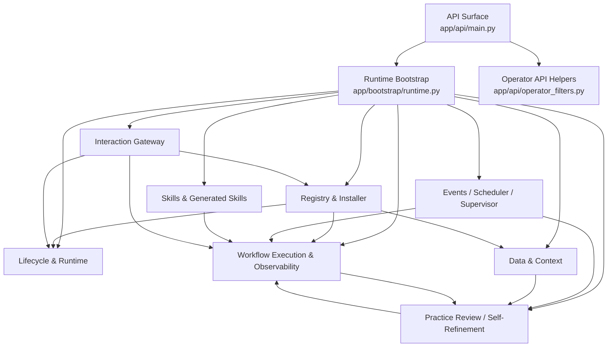

---

## 3. 模块关系网（按域分组）

### 3.1 App / Runtime Core

```mermaid
graph TD
    BR[app/bootstrap/runtime.py] --> LC[services/lifecycle.py]
    BR --> RH[services/runtime_host.py]
    BR --> RS[services/runtime_state_store.py]
    BR --> AR[services/app_registry.py]
    BR --> AI[services/app_installer.py]
    BR --> AD[services/app_data_store.py]
    BR --> AC[services/app_context_store.py]
    BR --> SCH[services/scheduler.py]
    BR --> EV[services/event_bus.py]
    BR --> SUP[services/supervisor.py]
    BR --> WE[services/workflow_executor.py]
    BR --> WO[services/workflow_observability.py]
    BR --> WS[services/workflow_subscription.py]
    BR --> PR[services/practice_review.py]
    BR --> SR[services/self_refinement.py]
    BR --> RL[services/refinement_loop.py]
    BR --> RM[services/refinement_memory.py]
    BR --> RR[services/refinement_rollout.py]
    BR --> SG[services/skill_suggestion.py]
    BR --> SF[services/skill_factory.py]
    BR --> SKR[services/skill_runtime.py]
    BR --> IG[services/interaction_gateway.py]

    AI --> AR
    AI --> LC
    AI --> RH
    AI --> AD
    AI --> AC

    RH --> LC
    SCH --> LC
    SCH --> RH
    EV --> SCH
    SUP --> LC
    SUP --> RH
```

### 3.2 Registry / Blueprint / Install

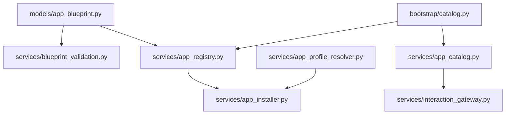

### 3.3 Data / Context / Persistence

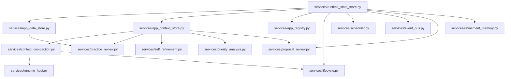

### 3.4 Workflow Execution / Observability

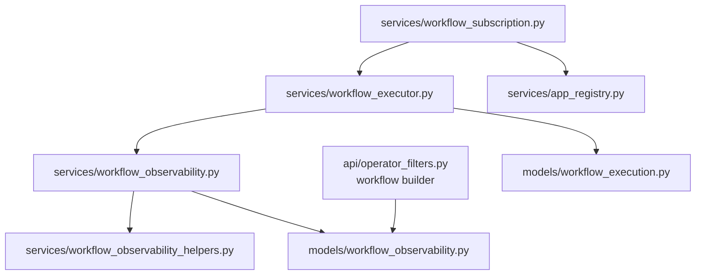

### 3.5 Learning / Self-Refinement / Rollout

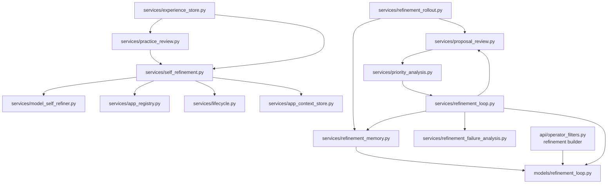

### 3.6 Skills / Generated Skills / System Skills

> Security note: changes in skill manifest risk metadata or script command restrictions should be treated as cross-cutting changes touching manifest models, validators, generated-skill flows, runtime assumptions, and security-oriented tests.


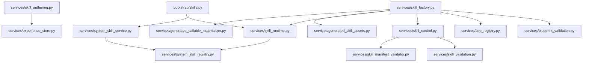

### 3.7 Interaction / Routing

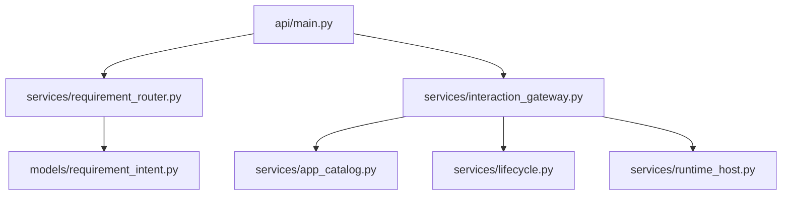

### 3.8 External Model / Config

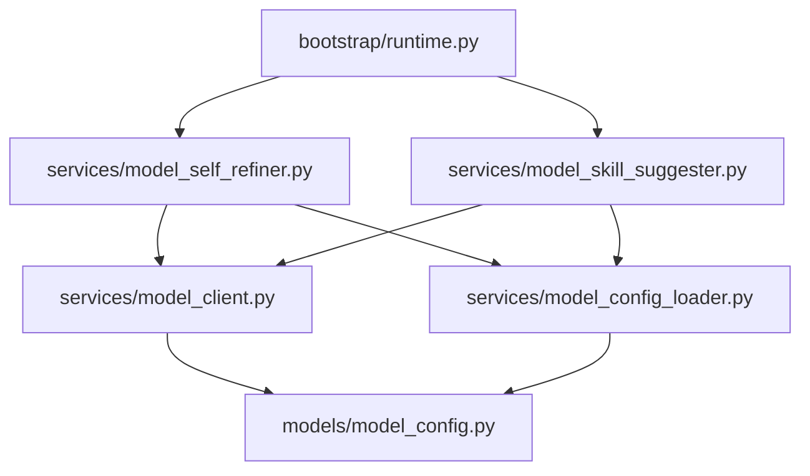

---

## 4. Operator Surface Contract Map

> 这是最近持续在统一的一条主线，和后续运维视图、自我迭代都强相关。

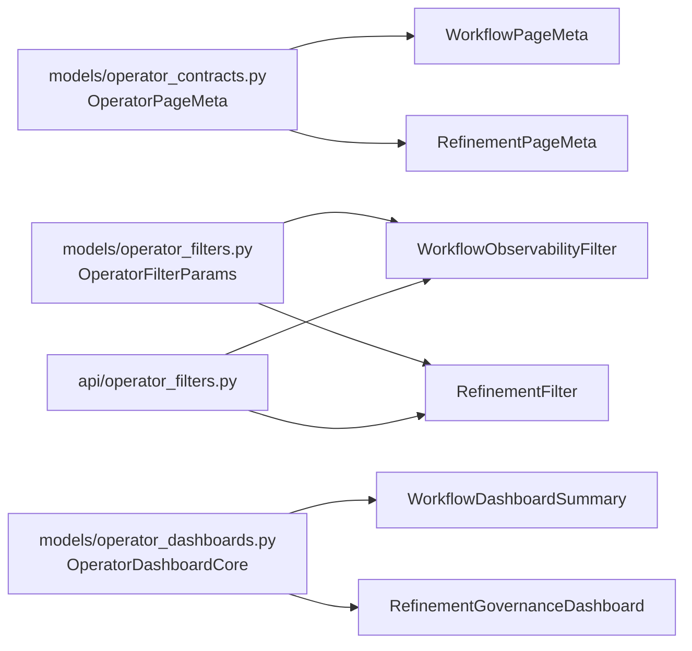

**改这里通常会影响：**
- `app/models/workflow_observability.py`
- `app/models/refinement_loop.py`
- `app/api/operator_filters.py`
- `app/api/main.py`
- `tests/unit/test_operator_page_meta.py`
- `tests/unit/test_operator_filter_params.py`
- `tests/unit/test_operator_dashboard_core.py`
- workflow / refinement 各自 observability 测试

---

## 5. 功能 -> 模块 -> 测试 映射图

## 5.1 Requirement Router / Intent Routing

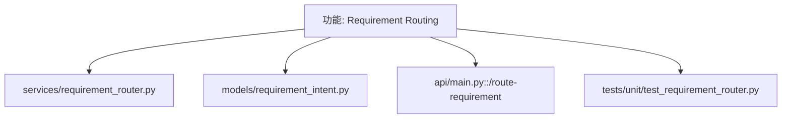

## 5.2 Registry / Install / Lifecycle

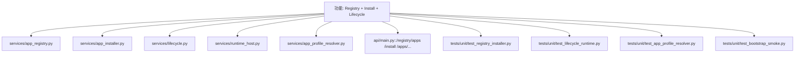

## 5.3 Data / Context / Compaction

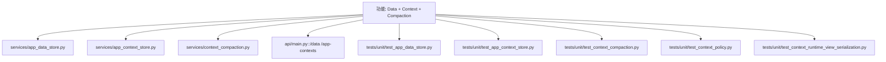

## 5.4 Event Bus / Scheduler / Supervisor

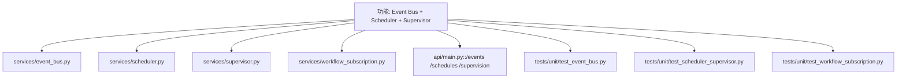

## 5.5 Workflow Execution / Failure / Observability

```mermaid
graph TD
    F[功能: Workflow Execution + Observability]
    F --> WE[services/workflow_executor.py]
    F --> WO[services/workflow_observability.py]
    F --> WOH[services/workflow_observability_helpers.py]
    F --> MC[models/workflow_execution.py]
    F --> MO[models/workflow_observability.py]
    F --> APIO[api/operator_filters.py]
    F --> A[api/main.py::/workflows/...]
    F --> T1[tests/unit/test_workflow_executor.py]
    F --> T2[tests/unit/test_workflow_observability.py]
    F --> T3[tests/unit/test_workflow_execution_failure_observability.py]
    F --> T4[tests/unit/test_observability.py]
    F --> T5[tests/unit/test_api_golden_path.py]
    F --> T6[tests/unit/test_golden_path_integration.py]
```

## 5.6 Practice Review / Experience / Demonstration Extraction

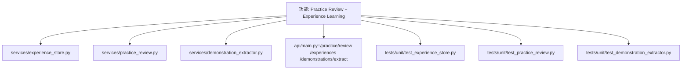

## 5.7 Self-Refinement Proposal Generation

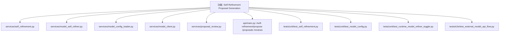

## 5.8 Refinement Loop / Priority / Rollout / Memory / Governance

```mermaid
graph TD
    F[功能: Refinement Loop + Governance]
    F --> PA[services/priority_analysis.py]
    F --> RL[services/refinement_loop.py]
    F --> RM[services/refinement_memory.py]
    F --> RR[services/refinement_rollout.py]
    F --> RFA[services/refinement_failure_analysis.py]
    F --> M[models/refinement_loop.py]
    F --> APIO[api/operator_filters.py]
    F --> A[api/main.py::/self-refinement/loop /overview /dashboard /stats /governance-dashboard]
    F --> T1[tests/unit/test_priority_analysis.py]
    F --> T2[tests/unit/test_refinement_loop.py]
    F --> T3[tests/unit/test_refinement_loop_persistence.py]
    F --> T4[tests/unit/test_refinement_rollout.py]
    F --> T5[tests/unit/test_refinement_overview.py]
    F --> T6[tests/unit/test_refinement_dashboard.py]
    F --> T7[tests/unit/test_refinement_failure_awareness.py]
    F --> T8[tests/unit/test_refinement_filters_and_stats.py]
    F --> T9[tests/unit/test_refinement_governance_dashboard.py]
    F --> T10[tests/unit/test_api_refinement_governance_path.py]
    F --> T11[tests/unit/test_refinement_observability_api.py]
```

## 5.9 Skill Suggestion / Skill Runtime / System Skills / Generated Skills

```mermaid
graph TD
    F[功能: Skills Runtime + Suggestion + Generation]
    F --> SG[services/skill_suggestion.py]
    F --> SKR[services/skill_runtime.py]
    F --> SC[services/skill_control.py]
    F --> SA[services/skill_authoring.py]
    F --> SF[services/skill_factory.py]
    F --> GCM[services/generated_callable_materializer.py]
    F --> GSA[services/generated_skill_assets.py]
    F --> SSR[services/system_skill_registry.py]
    F --> SSS[services/system_skill_service.py]
    F --> A[api/main.py::/skills /apps/from-skills /skill-runtime/...]
    F --> T1[tests/unit/test_skill_suggestion.py]
    F --> T2[tests/unit/test_skill_runtime.py]

> Suggestion note: skill suggestion now depends not only on experience data and optional model synthesis, but also on risk governance state when available. Changes in risk policy summaries can therefore alter generated-skill suggestion behavior.
    F --> T3[tests/unit/test_skill_runtime_adapters.py]
    F --> T4[tests/unit/test_skill_control.py]
    F --> T5[tests/unit/test_skill_authoring.py]
    F --> T6[tests/unit/test_skill_factory_api.py]
    F --> T7[tests/unit/test_skill_diagnostics_api.py]
    F --> T8[tests/unit/test_generated_callable_skill.py]
    F --> T9[tests/unit/test_generated_skill_persistence.py]
    F --> T10[tests/unit/test_generated_skill_durability.py]
    F --> T11[tests/unit/test_generated_app_durability.py]
    F --> T12[tests/unit/test_system_app_config_skill.py]
    F --> T13[tests/unit/test_system_context_skill.py]
    F --> T14[tests/unit/test_system_state_and_audit_skills.py]
    F --> T15[tests/unit/test_skill_factory_risk_gating.py]
    F --> T16[tests/unit/test_skill_policy_diagnostics_api.py]
    F --> T17[tests/unit/test_skill_risk_policy.py]
    F --> T18[tests/unit/test_skill_risk_override_api.py]
    F --> T19[tests/unit/test_skill_risk_dashboard.py]

> Governance note: skill risk policy now has both decision state and event trail. Changes here should be treated as touching policy persistence, generated app assembly, API governance surfaces, and future audit/dashboard layers.
```

## 5.10 Interaction Gateway / End-to-End API Usable Flow

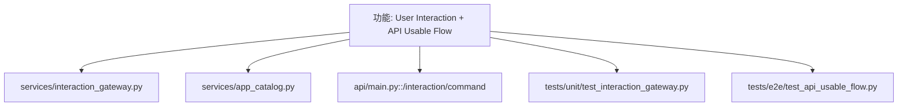

---

## 6. 测试关系网（按“改哪里，先跑哪些”组织）

### 6.1 改 `app/api/main.py`

优先跑：
- `tests/unit/test_api_golden_path.py`
- `tests/unit/test_api_refinement_governance_path.py`
- 对应功能域的 unit tests
- `tests/e2e/test_api_usable_flow.py`（如果改动较大）

### 6.2 改 `app/bootstrap/runtime.py`

优先跑：
- `tests/unit/test_bootstrap_smoke.py`
- `tests/unit/test_runtime_model_refiner_toggle.py`
- `tests/unit/test_lifecycle_runtime.py`
- 任何被 runtime wiring 接入的域测试

### 6.3 改 workflow observability / operator contract

优先跑：
- `tests/unit/test_workflow_observability.py`
- `tests/unit/test_workflow_execution_failure_observability.py`
- `tests/unit/test_observability.py`
- `tests/unit/test_operator_page_meta.py`
- `tests/unit/test_operator_filter_params.py`
- `tests/unit/test_operator_dashboard_core.py`
- `tests/unit/test_operator_api_filters.py`

### 6.4 改 refinement governance / self-refinement

优先跑：
- `tests/unit/test_self_refinement.py`
- `tests/unit/test_priority_analysis.py`
- `tests/unit/test_refinement_loop.py`
- `tests/unit/test_refinement_failure_awareness.py`
- `tests/unit/test_refinement_rollout.py`
- `tests/unit/test_refinement_filters_and_stats.py`
- `tests/unit/test_refinement_governance_dashboard.py`
- `tests/unit/test_api_refinement_governance_path.py`

### 6.5 改 skill runtime / generated skills

优先跑：
- `tests/unit/test_skill_runtime.py`
- `tests/unit/test_skill_runtime_adapters.py`
- `tests/unit/test_skill_control.py`
- `tests/unit/test_skill_factory_api.py`
- `tests/unit/test_generated_callable_skill.py`
- `tests/unit/test_generated_skill_persistence.py`
- `tests/unit/test_generated_skill_durability.py`
- `tests/unit/test_generated_app_durability.py`

---

## 7. 改动检查清单（防漏改）

### 7.1 改模型（`app/models/*`）时

检查：
- 哪些 service 构造 / 返回它？
- 哪些 API endpoint 直接 `model_dump` 它？
- 哪些测试在断言字段名？
- docs 里的 contract / design / testing 是否需要同步？

### 7.2 改 service（`app/services/*`）时

检查：
- runtime bootstrap 有没有 wiring 变化？
- API 是否需要新增/修改入口？
- persistence 是否需要迁移或兼容？
- 对应 unit tests / golden path tests 是否要补？

### 7.3 改 API helper / operator contract 时

检查：
- `app/api/main.py`
- `app/api/operator_filters.py`
- `app/models/operator_*`
- workflow / refinement 两侧是否都要同步
- `test_operator_*` 系列是否都要补跑

### 7.4 改 self-refinement / model path 时

检查：
- `app/bootstrap/runtime.py`
- `services/self_refinement.py`
- `services/model_self_refiner.py`
- `services/model_config_loader.py`
- `tests/unit/test_runtime_model_refiner_toggle.py`
- `tests/unit/test_self_refinement.py`
- `tests/e2e/test_external_model_api_flow.py`

### 7.5 改 refinement loop / rollout 验证策略时

检查：
- `services/refinement_loop.py`
- `services/refinement_rollout.py`
- `services/refinement_memory.py`
- `tests/unit/test_refinement_loop.py`
- `tests/unit/test_refinement_rollout.py`
- `tests/unit/test_refinement_filters_and_stats.py`
- `tests/unit/test_refinement_governance_dashboard.py`
- 是否影响 API path 测试的耗时与稳定性

---

## 8. 关系边定义说明

本图里的边不是只表示“import”。它表示下面任意一种关系：

- 直接调用 / 依赖
- 运行时 wiring
- 共享 contract
- 同一能力域
- API 对 service 的暴露
- 测试对模块/功能的覆盖
- 后续演化时应一起检查的耦合关系

也就是说，这是一张**改动影响网**，不是纯代码静态依赖图。

---

## 9. 维护建议

> **强制维护规则**
>
> `docs/system-relationship-map.md` 是 AgentSystem 的长期系统关系索引。
> 以后无论是人工开发还是系统自我迭代，只要发生以下任一种改动，都必须同步更新本文件：
>
> - 新增/删除/重命名模块
> - 新增/删除/重命名 API、service、model、bootstrap wiring
> - 新增功能域或功能边界变化
> - 新增、删除或迁移重要测试
> - 新增 shared contract / shared helper
> - 任何导致“改哪里会牵动哪些地方”答案变化的结构调整
>
> 原则：**代码变了，关系网也要变。**
> 不允许把本文件当成一次性文档；它必须和系统一起演化。

后续每完成一个模块，建议同步更新这里至少一处：

- 新增能力域 → 在“功能 -> 模块 -> 测试映射图”补一块
- 新增 shared contract → 在“Operator Surface Contract Map”补节点
- 新增重要测试 → 挂到对应功能图和“改哪里先跑哪些”里
- 如果两个模块开始频繁一起改 → 即使不是直接 import，也补一条边

> 原则：**宁可多连一条边，也不要少连一条会导致漏改的边。**
